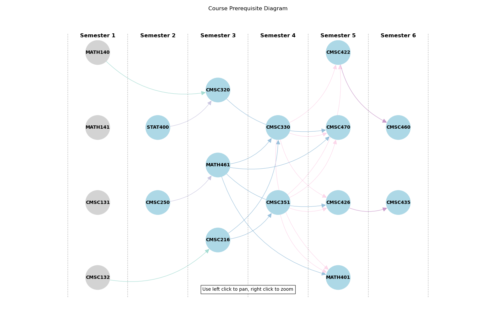

# GradPath

GradPath is a visualization tool designed to help students plan their academic journey by exploring course prerequisites and organizing them into semesters.

## 🔗 Live Demo
Check out the interactive web app here: **[GradPath Demo](https://jaimanm.github.io/gradpath)**



## 🖥️ Web App

The GradPath web application provides an interactive interface to explore course dependencies.

### Features
*   **Interactive Graph:** Visualizes courses as nodes and prerequisites as directed edges using [Cytoscape.js](https://js.cytoscape.org/).
*   **Semester Planning:** Automatically organizes courses into a semester-by-semester layout based on topological sorting of prerequisites.
*   **"Build Your Own" Flow:** Start with a blank canvas and add courses to see their specific prerequisite tree.
*   **Visual Styling:** Uses distinct pastel colors for each semester and clear visuals for dependencies.

### Technologies
*   **Frontend:** HTML5, CSS3, Vanilla JavaScript
*   **Visualization:** Cytoscape.js
*   **Hosting:** GitHub Pages


## 🐍 Python Scripts

The original prototype for this project was built in Python using Matplotlib for visualization. These scripts can be found on the **[`python`](https://github.com/jaimanm/gradpath/tree/python)** branch of this repository.

To view or run the Python version, switch to the branch:
```bash
git checkout python
```

### Key Scripts (on `python` branch)
*   **`complete_diagram.py`**: A script that defines a comprehensive set of courses, prerequisites, and AP credits to generate a static semester plan visualization using Matplotlib.
*   **`build_your_own.py`**: An interactive tool that allows users to select courses from a dropdown menu to dynamically build a personalized graduation plan.

### Data Processing (Current Branch)
In the current web-app branch, `scripts/build_data.py` is a utility script derived from the original logic. It bridges the gap between the raw JSON data and the frontend by generating the `data.js` file used by the web app.

## 🚀 Local Development

To run the project locally:

1.  Clone the repository.
    ```bash
    git clone https://github.com/jaimanm/gradpath.git
    ```
2.  Open `index.html` in your web browser.
    *   No build server required!
